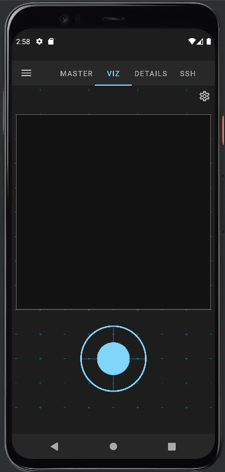
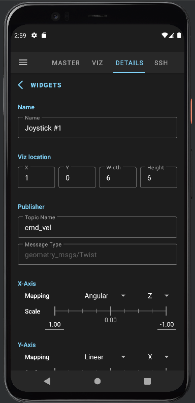
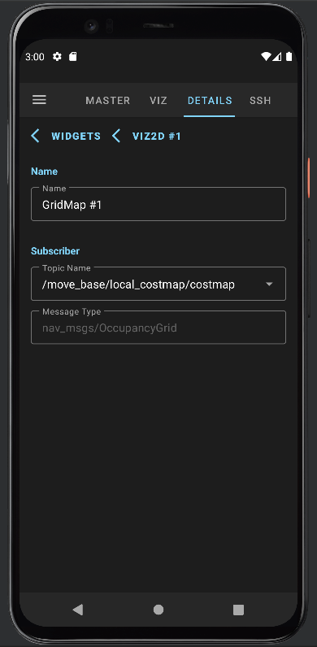
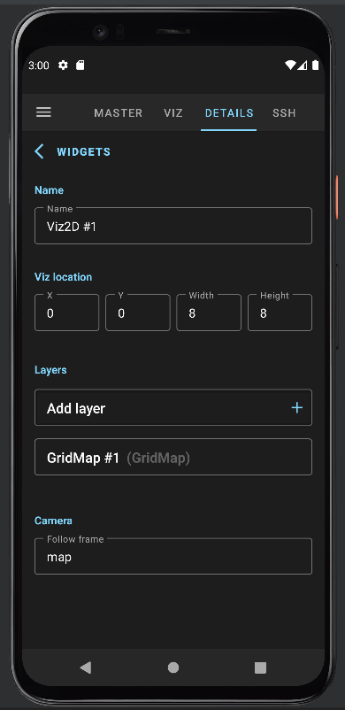
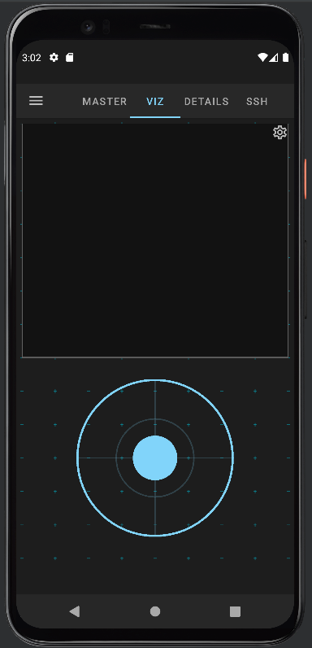
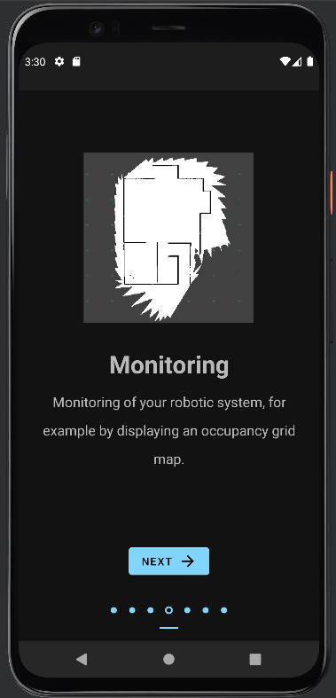
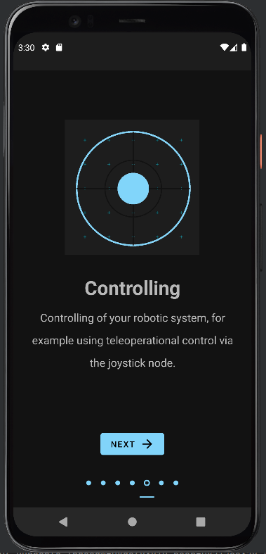

# ROS2-Android-APP

ROS2-Android-APP is an [Android](https://www.android.com/) application designed for dynamic control and visualization of mobile robotic system operated by the Robot Operating System ([ROS](http://wiki.ros.org/)). The application uses ROS nodes initializing publisher and subscriber with standard ROS messages. The overall code architecture pattern is Model View ViewModel (MVVM), which stabilizes the application and makes it highly customizable.

## Requirements

- Mobile Android Device with Android Version 5.0 (Lollipop) or lower than Android 12 (Excluding Android 12)
- Android Studio Version 3.6.1 or higher (if built from source)

## Installing Instructions

Run the program install ROS-Android-APP onto your mobile device: Built from source.

##### Built from Source:

- Install Android Studio Version 3.6.1 or higher
- Download the complete repository (Master Branch) and open it via Android Studio
- Built the Code (Make Project Button), connect your mobile device to your PC and install the Software (Run 'app'). Make sure you activated the developer options and adb debugging on your mobile device and installed all required drivers for usb and adb.

## Currently available ROS Nodes

The following Nodes are currently supported by ROS-Mobile. 

- Debug (similar to rostopic echo)

- Joystick (geometry_msgs/Twist)

- GridMap (nav_msgs/OccupancyGrid)

- Camera (sensor_msgs/Image, sensor_msgs/CompressedImage)

- GPS (sensor_msgs/NavSatFix)

- Button (std_msgs/Bool)

- Logger (std_msgs/String)

We manually map an apartment environment using a differential drive robot. To establish a connection, we link the application to the ROS master, which is running on the differential drive robot, over a wireless LAN. This involves entering the correct IP address in the MASTER configuration tab (refer to the first figure). By adding ROS nodes in the DETAILS tab (see the second and third figures), we enable control of the differential drive robot using a joystick method. This method sends geometry_msgs/Twist messages to the cmd_vel topic. Additionally, we visualize the generated occupancy grid map by subscribing to the map topic using a gridmap method. In the VIZ tab (far right figure), the recorded occupancy grid map is displayed alongside the joystick. Users can interact with the joystick through touch, sending control inputs over the cmd_vel topic to the differential drive robot.

## Outputs:

